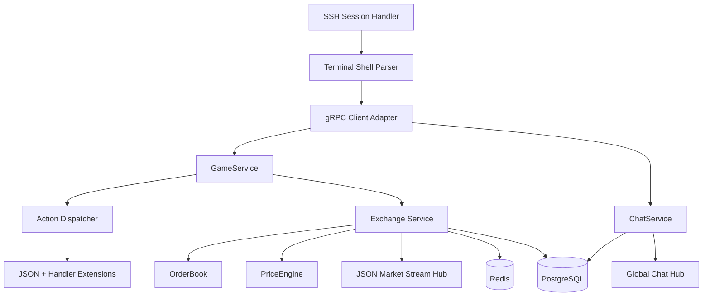

# ssh-arena

Terminal-first multiplayer exchange game server in Go.

This repository now contains a working exchange core on top of the original skeleton:

- SSH login and first-login bootstrap with automatic role assignment
- JSON-first gRPC contract design for gameplay, market streaming, and chat
- Price-time priority order book
- Dynamic price engine with supply/demand pressure and whale amplification
- Global chat broadcast hub
- JSON-driven tickers, roles, and action metadata
- PostgreSQL-first atomicity model with Redis for orderbook cache and fan-out

## 1. High-level Updates to Architecture

### Updated C4 Component



### Why gRPC plus JSON serialization is perfect here

- gRPC gives low-latency bidirectional streams for market data, chat, and action responses.
- The SSH client stays extremely simple because the server sends ready-to-print JSON strings.
- Protobuf still gives versioned RPC contracts while JSON keeps terminal parsing dead-simple.
- The shell is a thin transport adapter and never owns market state.
- New action types can keep using the generic `ExecuteAction` RPC instead of changing the transport every time.

## 2. Updated Project Structure

```text
.
|-- cmd/
|   |-- grpc-game/
|   |   `-- main.go
|   `-- ssh-server/
|       `-- main.go
|-- config/
|   |-- actions/
|   |   |-- place_order.json
|   |   |-- player_transfer_money.json
|   |   `-- send_chat_message.json
|   `-- roles.json
|-- events/
|   |-- market_crash.json
|   `-- stocks.json
|-- extensions/
|   |-- market_crash/
|   |   `-- handler.go
|   `-- player_transfer_money/
|       `-- handler.go
|-- internal/
|   |-- actions/
|   |   |-- registry.go
|   |   `-- types.go
|   |-- chat/
|   |   |-- chat_service.go
|   |   `-- chat_service_test.go
|   |-- config/
|   |   `-- loader.go
|   |-- events/
|   |   `-- registry.go
|   |-- exchange/
|   |   |-- cache.go
|   |   |-- price_engine.go
|   |   |-- service.go
|   |   |-- stocks.go
|   |   `-- types.go
|   |-- orderbook/
|   |   |-- orderbook.go
|   |   `-- orderbook_test.go
|   |-- platform/
|   |   `-- tx/
|   |       `-- manager.go
|   `-- roles/
|       |-- role_assignment.go
|       `-- role_assignment_test.go
|-- migrations/
|   |-- 001_initial.sql
|   `-- 002_exchange_core.sql
|-- proto/
|   `-- game/
|       `-- v1/
|           `-- game.proto
|-- go.mod
|-- go.sum
`-- README.md
```

## 3. Domain Model Updates

### New entities

- `OrderBook`: in-memory price-time priority market state per symbol.
- `Bid` and `Ask`: aggregated from individual resting limit orders.
- `Ticker`: config-driven stock metadata and liquidity tuning.
- `PriceHistory`: immutable price movement audit trail.
- `PlayerRole`: `Buyer`, `Holder`, or `Whale`.

### Initial tickers config

The initial market lives in [`events/stocks.json`](events/stocks.json) and includes at least:

- `TECH`
- `ENERGY`
- `FOOD`
- `CRYPTO`
- `DEFENSE`
- `PHARMA`
- `ENTERTAINMENT`
- `TRANSPORT`

Example:

```json
{
  "symbol": "TECH",
  "name": "TechCore Systems",
  "sector": "technology",
  "initial_price": 1000,
  "tick_size": 5,
  "liquidity_units": 18000,
  "whale_threshold": 4500
}
```

## 4. Role & Registration System

### How SSH connection and registration works

1. The player connects via SSH.
2. The SSH server authenticates password or key.
3. On first successful login, the SSH gateway calls `EnsurePlayer`.
4. The backend assigns a role and starting resources.
5. The player immediately receives a bootstrap JSON payload with role, cash, and holdings.

### Role assignment rules

- 10 percent of new players become `Whale` when the quota is still open.
- The remaining 90 percent are balanced between `Buyer` and `Holder`.
- `Buyer` gets a lot of cash and only small starter holdings.
- `Holder` gets more inventory and less cash.
- `Whale` gets huge cash and deep inventory, enough to move markets alone.

### Example role config

[`config/roles.json`](config/roles.json):

```json
{
  "Buyer": {
    "cash": 350000,
    "variance_pct": 8,
    "base_holdings": {
      "*": 8
    }
  },
  "Holder": {
    "cash": 120000,
    "variance_pct": 10,
    "base_holdings": {
      "*": 55,
      "TECH": 70,
      "CRYPTO": 65,
      "ENERGY": 60
    }
  },
  "Whale": {
    "cash": 2500000,
    "variance_pct": 12,
    "whale_influence_bps": 15000,
    "base_holdings": {
      "*": 220,
      "TECH": 300,
      "CRYPTO": 280,
      "ENERGY": 260,
      "DEFENSE": 250
    }
  }
}
```

### Example first-login bootstrap JSON

```json
{
  "type": "bootstrap",
  "player_id": "1f61e5d8-7059-4d9e-9fc7-56b2bb950f07",
  "username": "alice",
  "role": "Whale",
  "cash": 2740000,
  "portfolio": {
    "TECH": 312,
    "ENERGY": 251,
    "FOOD": 214,
    "CRYPTO": 296,
    "DEFENSE": 258,
    "PHARMA": 224,
    "ENTERTAINMENT": 206,
    "TRANSPORT": 219
  }
}
```

## 5. Order Book & Matching Engine

### Real bids and asks

`internal/orderbook/orderbook.go` implements:

- price-time priority matching
- limit and market orders
- aggregated bid and ask levels
- per-order remaining quantity tracking
- JSON snapshots for terminal clients

### Matching rules

- Buy orders match the best ask first.
- Sell orders match the best bid first.
- Within the same price, the oldest resting order wins.
- Market orders consume liquidity until exhausted, then any remainder is cancelled.
- Limit orders that do not fully fill become resting orders.

### Example orderbook snapshot JSON

```json
{
  "symbol": "TECH",
  "last_trade_price": 1010,
  "sequence": 44,
  "bids": [
    {"price": 1005, "quantity": 130, "order_count": 4},
    {"price": 1000, "quantity": 200, "order_count": 6}
  ],
  "asks": [
    {"price": 1010, "quantity": 90, "order_count": 3},
    {"price": 1015, "quantity": 140, "order_count": 5}
  ],
  "generated_at": "2026-03-20T18:00:00Z"
}
```

### Buy and sell order payloads

Limit buy:

```json
{
  "symbol": "TECH",
  "side": "buy",
  "type": "limit",
  "price": 1000,
  "quantity": 10
}
```

Market sell:

```json
{
  "symbol": "CRYPTO",
  "side": "sell",
  "type": "market",
  "quantity": 40
}
```

### Dynamic price calculation

`internal/exchange/price_engine.go` adjusts price using:

- signed buy versus sell volume
- visible orderbook imbalance
- coordinated same-side bursts
- whale participation multiplier

The engine computes a bounded basis-point move and aligns the new price to the ticker tick size.

### Pump and dump examples

Pump example:

- A whale places aggressive market buys on `CRYPTO`.
- Buy pressure overwhelms the top ask depth.
- Whale multiplier amplifies the move.
- The new price jumps sharply and the orderbook shifts upward.

Dump example:

- Coordinated `Holder` plus `Whale` market sells hit `TECH`.
- Sell pressure exceeds bid depth.
- The price engine applies a negative move.
- The market snapshot and recent trades immediately reflect the drop.

### Example trade JSON

```json
{
  "id": "req-123-1",
  "symbol": "TECH",
  "price": 1010,
  "quantity": 15,
  "aggressor_side": "buy",
  "buy_order_id": "bid-77",
  "sell_order_id": "ask-12",
  "buyer_id": "player-a",
  "seller_id": "player-b",
  "buyer_role": "Whale",
  "seller_role": "Holder",
  "executed_at": "2026-03-20T18:00:05Z"
}
```

## 6. Real-time JSON Streaming

### gRPC JSON-first design

All gameplay responses and stream events carry JSON strings inside protobuf messages.

Updated contract:

```proto
message JsonEnvelope {
  string topic = 1;
  string json = 2;
  int64 sequence = 3;
}

service GameService {
  rpc ExecuteAction(ActionRequest) returns (ActionResponse);
  rpc GetMarketStream(stream MarketStreamRequest) returns (stream JsonEnvelope);
}
```

### GetMarketStream behavior

The market stream is intended to push ready-to-print JSON for:

- full orderbook snapshot
- current price point
- recent trades
- portfolio deltas
- chat messages when requested

### Example market update JSON

```json
{
  "type": "market.update",
  "payload": {
    "order": {
      "id": "f67b54ce-2758-45b0-b507-6eb7613152c9",
      "request_id": "f67b54ce-2758-45b0-b507-6eb7613152c9",
      "player_id": "player-a",
      "player_role": "Buyer",
      "symbol": "TECH",
      "side": "buy",
      "type": "limit",
      "price": 1000,
      "quantity": 10,
      "remaining_quantity": 0,
      "status": "filled",
      "created_at": "2026-03-20T18:00:05Z"
    },
    "orderbook": {
      "symbol": "TECH",
      "last_trade_price": 1000,
      "sequence": 19,
      "bids": [{"price": 995, "quantity": 80, "order_count": 2}],
      "asks": [{"price": 1005, "quantity": 65, "order_count": 2}],
      "generated_at": "2026-03-20T18:00:05Z"
    },
    "price": {
      "symbol": "TECH",
      "previous_price": 995,
      "current_price": 1000,
      "net_volume": 10,
      "buy_pressure": 10,
      "sell_pressure": 0,
      "whale_volume": 0,
      "whale_multiplier_bps": 10000,
      "move_bps": 50,
      "updated_at": "2026-03-20T18:00:05Z"
    },
    "recent_trades": []
  }
}
```

## 7. Internal Chat

### Chat service

`internal/chat/chat_service.go` provides:

- global broadcast channel
- rolling in-memory history
- subscriber fan-out
- ready-to-print JSON strings

Updated gRPC contract:

```proto
service ChatService {
  rpc SendChat(ChatRequest) returns (JsonEnvelope);
  rpc StreamChat(MarketStreamRequest) returns (stream JsonEnvelope);
}
```

### Example chat JSON

```json
{
  "type": "chat.message",
  "channel": "global",
  "player_id": "player-a",
  "username": "alice",
  "role": "Whale",
  "body": "I am buying every last share of TECH.",
  "sent_at": "2026-03-20T18:01:00Z"
}
```

## 8. Dynamic Extensibility Still Works

The exchange remains extension-friendly.

### Add a new order type

1. Add a JSON definition in `config/actions/`.
2. Add one handler file in `extensions/` or `internal/actions/`.
3. Reuse the generic `ExecuteAction` RPC.
4. Keep the transport untouched.

### Add a new whale ability

Example: `whale.flash_crash`

1. Add `config/actions/whale_flash_crash.json`.
2. Add `extensions/whale_flash_crash/handler.go`.
3. The handler can call the price engine or enqueue an event.
4. The resulting market update still goes out as JSON through the same stream.

This keeps the “2-minute JSON plus handler” workflow alive.

## Build & Run Instructions

```bash
go mod tidy
go test ./...
go run ./cmd/grpc-game
go run ./cmd/ssh-server
```

Optional environment variables:

```bash
export GRPC_LISTEN_ADDR=:9090
export SSH_LISTEN_ADDR=:2222
export SSH_HOST_KEY_PATH=./config/dev/ssh_host_ed25519
export REDIS_ADDR=localhost:6379
```

## How to connect via SSH and get your role

```bash
ssh -p 2222 alice@localhost
```

On first login you will immediately receive a bootstrap JSON payload containing:

- `player_id`
- `role`
- `cash`
- `portfolio`

## How to place buy or sell order

From the SSH shell:

```text
place_order {"symbol":"TECH","side":"buy","type":"limit","price":1000,"quantity":10}
place_order {"symbol":"CRYPTO","side":"sell","type":"market","quantity":25}
```

From gRPC, send the same JSON inside `ActionRequest.payload_json`.

## How whales influence the market

- Whale volume increases the move multiplier.
- Whale buy bursts pump prices harder when orderbook depth is thin.
- Whale sell bursts dump prices harder when bid depth is weak.
- Coordinated trading pushes the same pressure signal further.
- The final move is bounded so markets stay playable, not instantly destroyed.

## Atomicity & Anti-Cheat Explanation

The current codebase implements the matching and pricing core in pure Go, but the authoritative production path remains PostgreSQL transactions plus locking.

For production mutations:

1. Start a serializable transaction.
2. Insert action journal row for idempotency.
3. Lock wallet, portfolio, and affected resting orders.
4. Apply fills, cash changes, inventory changes, and price history changes.
5. Commit once.
6. Publish Redis orderbook and stream updates only after commit.

This prevents:

- double-spend
- race-condition fills
- replayed order requests
- partial state application
- client-side cheating through forged balances

## Production Notes

- Redis should be treated as a speed layer, not a source of truth.
- PostgreSQL remains authoritative for orders, balances, price history, roles, and chat audit.
- The in-memory order book is intentionally clean and testable so it can be wrapped by transactional persistence logic.
- `go test ./...` passes for the current repository state.
