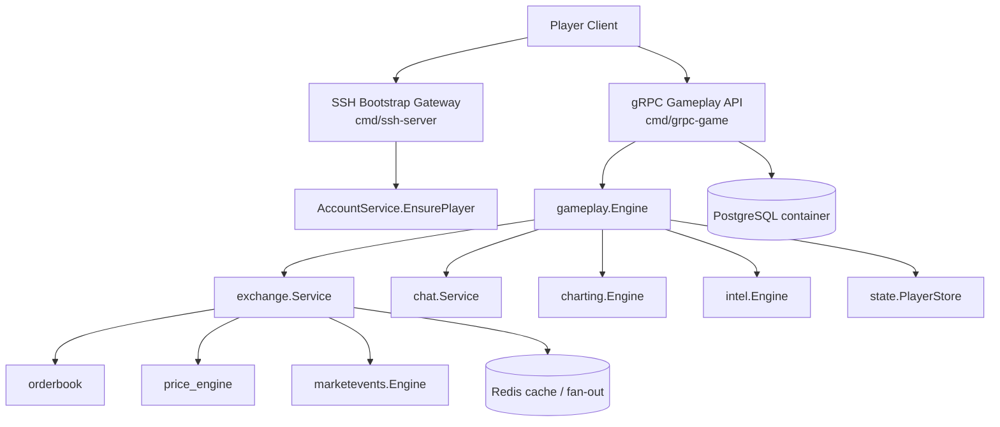

# ssh-arena

Terminal-first multiplayer exchange game server in Go.

`ssh-arena` is a shared market simulation where all players trade on one global exchange. SSH is used only for bootstrap, and all gameplay happens over gRPC with JSON payloads.

## What the game does today

- one global exchange for every online player
- SSH bootstrap for first login and account recovery
- gRPC gameplay API for orders, chat, market streams, and charts
- price-time priority order books
- dynamic price engine with order-flow pressure and event shocks
- random market events, rumors, fake news, paid analytics, and insider previews
- random but balanced starting resources by role
- persisted player state across reconnects

## Player flow

1. The player connects over SSH.
2. The SSH gateway calls `AccountService.EnsurePlayer`.
3. The server returns bootstrap JSON with `player_id`, role, cash, and holdings.
4. The SSH session closes.
5. The client connects to gRPC and starts the real game session.

## High-level architecture



## Runtime responsibilities

### `cmd/ssh-server`
- accepts password or public-key SSH login
- performs bootstrap only
- prints the advertised gRPC endpoint and bootstrap JSON
- closes the SSH session after bootstrap

### `cmd/grpc-game`
- starts the gameplay backend
- wires market, charting, chat, random events, and intel feeds together
- exposes `AccountService`, `GameService`, and `ChatService`

### `internal/gameplay`
- validates player actions
- keeps player portfolio and reservation state in sync
- routes `ExecuteAction` requests to the right subsystem
- exposes portfolio snapshots and private intel subscriptions

### `internal/exchange`
- owns the shared market instance
- manages the order books and matching pipeline
- recalculates prices after trades and shocks
- publishes market updates to subscribers

### `internal/intel`
- loads purchasable and public intel feeds from JSON
- supports `rumor`, `fake_news`, `paid_analytics`, and `insider`
- sends private insider previews before public market publication

### `internal/charting`
- emits periodic `price_chart_tick` snapshots
- includes price, history, VWAP, volatility, and top-of-book levels

### `internal/state`
- persists players to `data/players.json`
- keeps role, cash, reserved cash, holdings, and reserved stocks across reconnects

## Project structure

```text
.
|-- cmd/
|   |-- grpc-game/
|   |   `-- main.go
|   `-- ssh-server/
|       `-- main.go
|-- config/
|   |-- actions/
|   `-- roles.json
|-- docs/
|   `-- CLIENT_DEVELOPMENT_GUIDE.md
|-- events/
|   |-- intel_feeds.json
|   |-- random_events.json
|   `-- stocks.json
|-- extensions/
|   |-- market_crash/
|   `-- player_transfer_money/
|-- gen/
|   `-- game/v1/
|-- internal/
|   |-- actions/
|   |-- charting/
|   |-- chat/
|   |-- config/
|   |-- events/
|   |-- exchange/
|   |-- gameplay/
|   |-- grpcapi/
|   |-- grpcjson/
|   |-- intel/
|   |-- jsonfile/
|   |-- marketevents/
|   |-- orderbook/
|   |-- platform/
|   |-- roles/
|   `-- state/
|-- migrations/
|-- proto/
|   `-- game/v1/game.proto
|-- Dockerfile
|-- docker-compose.yml
|-- config.yaml
`-- README.md
```

## Roles and starting resources

Players are assigned one of three roles on first bootstrap:

- `Buyer`: more cash, lighter inventory
- `Holder`: less cash, deeper inventory
- `Whale`: large cash and inventory, able to move thin books

Role assignment is randomized but population-balanced:

- around 10% whales
- the rest split between buyers and holders
- starting resources vary within role templates instead of being identical clones

## Tickers

Default markets are loaded from `events/stocks.json`.

The starter list includes:

- `TECH`
- `ENERGY`
- `FOOD`
- `CRYPTO`
- `DEFENSE`
- `PHARMA`
- `ENTERTAINMENT`
- `TRANSPORT`

## Market model

### Matching

The order book supports:

- limit and market orders
- price-time priority
- partial fills
- resting orders
- cancellation

### Price formation

The price engine combines:

- signed buy and sell pressure
- top-of-book imbalance
- recent flow memory
- mean reversion bias
- whale amplification
- temporary event shocks

### Intel and market content

Two JSON-driven content systems shape the market:

- `events/random_events.json` for public random events
- `events/intel_feeds.json` for rumors, fake news, paid analytics, and insiders

Current intel kinds:

- `rumor`
- `fake_news`
- `paid_analytics`
- `insider`

## API surface

### SSH bootstrap

Connect with:

```bash
ssh -p 2222 alice@localhost
```

Typical bootstrap response:

```text
welcome, alice
grpc_endpoint=localhost:9090
{"type":"bootstrap",...}
{"type":"ssh.bootstrap.complete","message":"Use gRPC for gameplay commands, chat, charts and market streams."}
disconnecting from SSH bootstrap gateway
```

### gRPC services

- `AccountService.EnsurePlayer`
- `GameService.ExecuteAction`
- `GameService.GetMarketStream`
- `GameService.SubscribeToChart`
- `ChatService.SendChat`
- `ChatService.StreamChat`

All gameplay payloads are JSON strings inside gRPC messages.

### Market stream topics

`GetMarketStream` emits topics such as:

- `market`
- `chat`
- `portfolio`
- `private`

`private` is used for player-specific intel, such as insider previews.

## Supported actions

The current gameplay backend accepts these action ids:

- `place_order`
- `exchange.place_order`
- `cancel_order`
- `exchange.cancel_order`
- `portfolio.get`
- `player.portfolio`
- `portfolio`
- `market.snapshot`
- `chat.send`
- `send_chat_message`
- `intel.catalog`
- `intel.list`
- `intel.buy`

## Build and run

### Docker

```bash
docker compose down -v --remove-orphans
docker compose up --build
```

### Local Go run

```bash
go mod tidy
go test ./...
go run ./cmd/grpc-game
go run ./cmd/ssh-server
```

## Configuration

Runtime settings live in `config.yaml`:

```yaml
chart_tick_interval_seconds: 3
chart_history_points: 240
chart_orderbook_depth: 10
player_state_path: data/players.json
random_event_interval_seconds: 15
random_events_path: events/random_events.json
intel_event_interval_seconds: 12
intel_events_path: events/intel_feeds.json
```

## Persistence and current limitations

Persisted today:

- player identity
- role
- cash and reserved cash
- holdings and reserved stocks
- timestamps

Current limitation:

- live order books and resting orders are still process-local
- after a full backend restart, player accounts remain but live books are rebuilt

The repository still contains PostgreSQL transaction scaffolding, but the current live exchange loop is not yet fully backed by PostgreSQL for every mutation.

## Client development

See `docs/CLIENT_DEVELOPMENT_GUIDE.md` for:

- bootstrap flow
- JSON gRPC codec details
- Go and Python client examples
- market, chart, chat, and private intel streams
- action payload examples